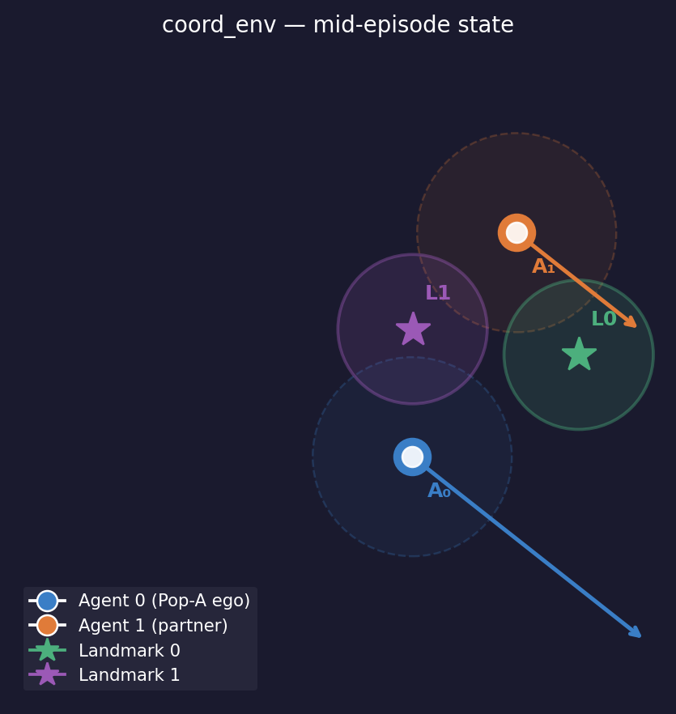
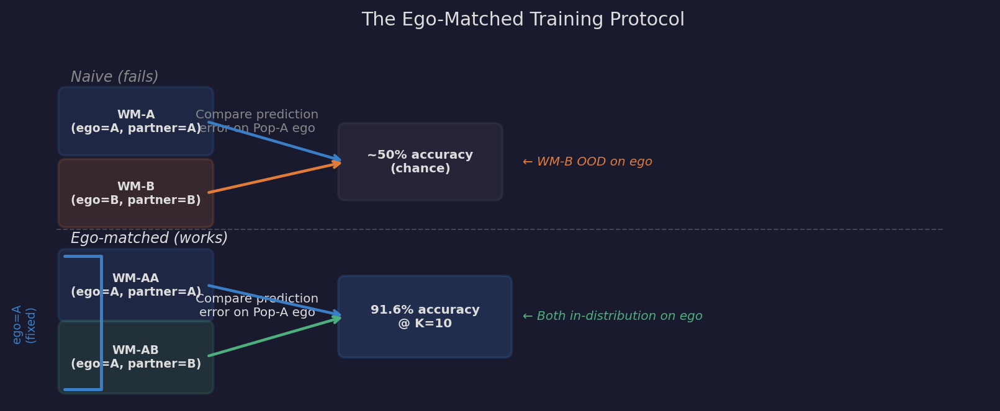

# World Models as Implicit Convention Detectors for Ad Hoc Teamwork

Two agents. Two landmarks. Neither knows what conventions the other has learned.
Can world models trained on past trajectories tell you who your partner is — and
does knowing help?

The answer is yes, but only with the right training protocol.

## Overview

We train PPO policies in two populations (Pop-A, Pop-B) on a coupled coordination
task. Convention mismatch between populations produces a significant coordination
penalty (gap = 3.28, p = 0.0004). We then ask: can a world model identify an
unknown partner's convention from a short observation window, and is that
identification accurate enough to drive real coordination improvements?

The key finding: a naive WM comparison gives chance-level identification. The
**ego-matched training protocol** we introduce reaches 91.6% accuracy at K=10
steps and, acting on that identification via policy switching, achieves a
coordination gain statistically indistinguishable from oracle performance
(p = 0.0002 vs no-adaptation baseline, p = 0.247 vs oracle).

---

## Environment

`coord_env` is a custom 2-agent coordination environment built on PettingZoo MPE.

<p align="center">
  
</p>

**Agents** (circles) must each reach and hold a **landmark** (stars). Two mechanics
create genuine interdependence:

- **Simultaneous coverage reward.** The full bonus fires only when *both* agents are
  within `COVER_RADIUS=0.3` of their respective landmarks at the same time. Arriving
  alone earns nothing. Coordination timing matters.

- **Momentum coupling.** Agents within `DRAG_RADIUS=0.4` of each other exchange a
  fraction of velocity. An agent's trajectory is physically influenced by its
  partner's movement, making each population's dynamics distinct.

- **Symmetric initialization.** Landmarks are placed equidistant from the agents'
  mean position, forcing each episode to require symmetry-breaking — which landmark
  does each agent go to?

**Observation** (10-dim, egocentric): `vel(2) + pos(2) + lm_rel(4) + other_rel(2)`
**Actions**: 5 discrete (stay, left, right, up, down)
**Episode length**: 25 steps

Two PPO populations trained from different random seeds develop different implicit
conventions — primarily in movement timing and momentum patterns rather than fixed
landmark preferences. These conventions are subtle enough that end-state analysis
alone cannot detect them, yet the world model encodes them with enough fidelity to
enable near-oracle partner identification.

---

## Ego-Matched World Models

<p align="center">
  
</p>

A world model takes `(obs_self, obs_partner, action_self)` and predicts `next_obs_self`.
Since the partner's action is not in the input, the model must implicitly encode what
the partner will do — learning the partner's convention from training data.

The naive approach compares WM-A (trained on A-ego, A-partner) against WM-B (trained
on B-ego, B-partner). When the ego is always Pop-A, WM-B is out-of-distribution on
the ego observations — so ego mismatch noise drowns any partner convention signal.
Both WMs give ~50% identification accuracy regardless of how long you observe.

**The fix:** train WM-AA and WM-AB both with Pop-A ego data, varying only the partner
population. Both WMs are always in-distribution for the ego. Any prediction error
difference between them is pure partner convention signal.

---

## Pipeline

```
train_policies.py               # Train Pop-A and Pop-B PPO policies
collect_trajectories.py         # Collect (obs_self, obs_partner, action, next_obs) data
train_world_models.py           # Train ego-matched WMs (WM-AA, WM-AB, WM-BB, WM-BA)
run_crossplay_experiment.py     # Measure cross-play gap
run_crossplay_identification.py # Partner identification accuracy curve
run_adaptive_identification.py  # Identification → policy switching → coordination gain
run_wm_only_agent.py            # WM-as-planner alignment experiment
run_simple_spread_contrast.py   # Negative control (no conventions)
make_figures.py                 # Generate all paper figures
```

Run steps in order. Each script saves results to `outputs/results/`.

## Setup

```bash
pip install -r requirements.txt
```

Tested with Python 3.10, PyTorch 2.0, PettingZoo 1.24.

---

## Results

See [RESULTS.md](RESULTS.md) for full results with tables and interpretation.

| Metric | coord_env | simple_spread |
|---|---|---|
| Convention Divergence Score | 152× noise floor | 1.01× noise floor |
| Partner ID — naive WMs (K=10) | 52.4% | 50.0% |
| Partner ID — ego-matched (K=10) | **91.6%** | 50.0% |
| Adaptive switching (K=10) | +2.639, p=0.0002 | — |
| Adaptive vs Oracle (K=10) | p=0.247 (n.s.) | — |

